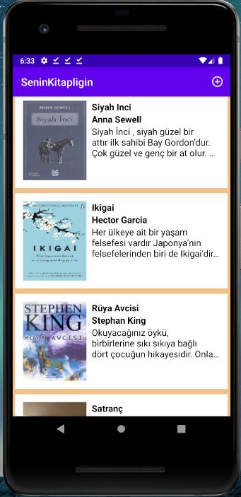
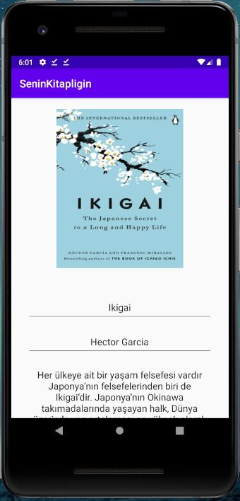
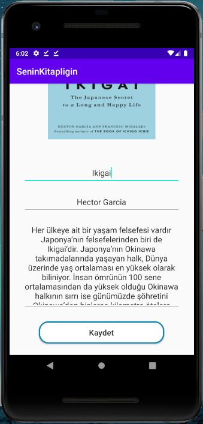
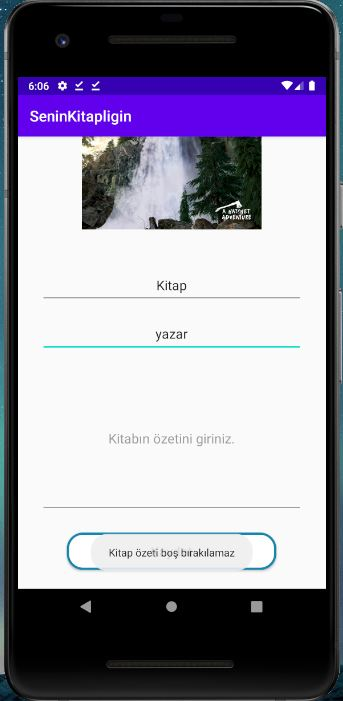

# SeninKitapligin SQlite 
Senin Kitaplığın android uygulaması.
Kendimi android alanında geliştirirken SQlite öğrendim. Bunu pekiştirmek için 
basit bir kitaplık uygulaması yaptım.

## Uygulama Ana Sayfası

Uygulamanın ana ekranı. Bu ekranda okuyup eklediğiniz kitaplar bulunmaktadır.
Listede bulunan bir kitaba tıkladığınızda o kitapla ilgili daha fazla bilgi 
elde edebileceğiniz yeni bir sayfaya (detay) gidersiniz

## Uygulama Kitap Ekleme Sayfası

      

Burada ana sayfanın sağ üst kısmında bulunan ekleme tuşuna bastıktan sonra açılan kitap ekleme sayfası gözükmektedir.

## Uygulama Kitap Eklem Sayfası Bilgi Verme

Eğer kitap eklerken boş bırakılan bir bölüm varsa sistem uyarı verecektir.

